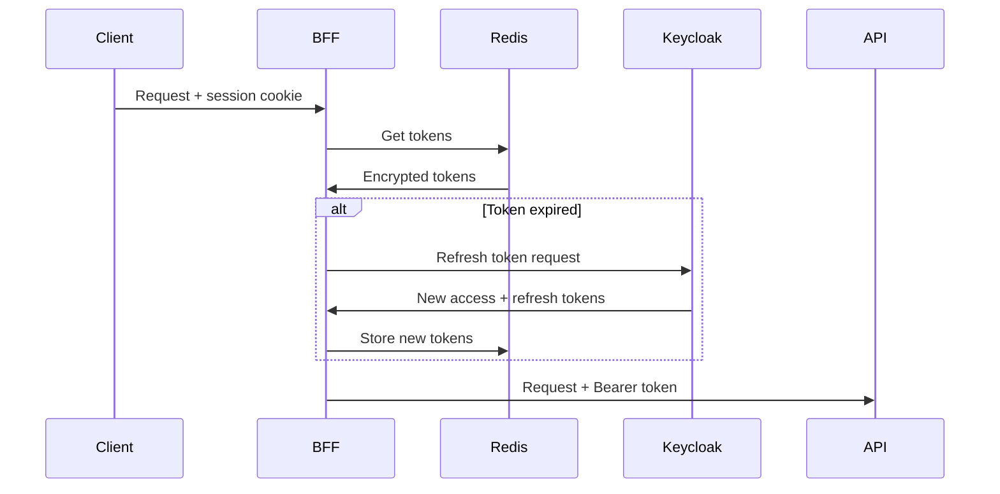

# Auth API (BFF)

## Обзор

BFF (Backend-for-Frontend) service обеспечивает аутентификацию через Keycloak с паттерном PKCE.

**Base URL**: `http://localhost:8000`

## Особенности

- Токены хранятся на сервере (не передаются клиенту)
- Использует HTTP-only, Secure cookies для сессий
- Автоматическое обновление access_token
- PKCE flow (S256 challenge)

## Endpoints

### Authentication

#### GET /auth/login

Инициация OAuth2 PKCE flow.

**Request**:
```http
GET /auth/login HTTP/1.1
Host: localhost:8000
```

**Response** `302 Found`:
```http
HTTP/1.1 302 Found
Location: http://localhost:8080/realms/reports-realm/protocol/openid-connect/auth
  ?client_id=bionicpro-auth
  &response_type=code
  &scope=openid%20profile%20email
  &redirect_uri=http://localhost:8000/auth/callback
  &state=abc123
  &code_challenge=E9Melhoa2OwvFrEMTJguCHaoeK1t8URWbuGJSstw-cM
  &code_challenge_method=S256
```

#### GET /auth/callback

OAuth2 callback endpoint. Обмен authorization code на токены.

**Request**:
```http
GET /auth/callback?code=xxx&state=abc123 HTTP/1.1
Host: localhost:8000
```

**Response** `302 Found`:
```http
HTTP/1.1 302 Found
Location: http://localhost:3000
Set-Cookie: session_id=xyz789; HttpOnly; Secure; SameSite=Lax; Path=/
```

#### POST /auth/logout

Завершение сессии.

**Request**:
```http
POST /auth/logout HTTP/1.1
Host: localhost:8000
Cookie: session_id=xyz789
```

**Response** `200 OK`:
```json
{
  "status": "logged_out"
}
```

**Response** `302 Found` (при redirect):
```http
HTTP/1.1 302 Found
Location: http://localhost:3000
Set-Cookie: session_id=; HttpOnly; Secure; SameSite=Lax; Path=/; Max-Age=0
```

### User Info

#### GET /auth/me

Информация о текущем пользователе.

**Request**:
```http
GET /auth/me HTTP/1.1
Host: localhost:8000
Cookie: session_id=xyz789
```

**Response** `200 OK`:
```json
{
  "sub": "550e8400-e29b-41d4-a716-446655440000",
  "preferred_username": "ivan.petrov",
  "email": "ivan.petrov@bionicpro.com",
  "name": "Ivan Petrov",
  "email_verified": true,
  "roles": ["prothetic_user"],
  "groups": ["/prothetic_users"]
}
```

**Response** `401 Unauthorized`:
```json
{
  "error": "Not authenticated"
}
```

### API Proxy

#### ANY /api/*

Прокси запросов к Reports Service с автоматической передачей токена.

**Request**:
```http
GET /api/reports HTTP/1.1
Host: localhost:8000
Cookie: session_id=xyz789
```

**Flow**:
1. BFF извлекает access_token из Redis по session_id
2. Если токен истёк, автоматически обновляет через refresh_token
3. Проксирует запрос к Reports Service с Bearer token

**Response**: Ответ от Reports Service

### Health

#### GET /health

Проверка работоспособности BFF.

**Response** `200 OK`:
```json
{
  "status": "healthy",
  "keycloak": "connected",
  "redis": "connected"
}
```

## Session Management

### Cookie Structure

```
session_id=<uuid>; HttpOnly; Secure; SameSite=Lax; Path=/; Max-Age=86400
```

| Attribute | Value | Описание |
|-----------|-------|----------|
| HttpOnly | true | Недоступен из JavaScript |
| Secure | true (prod) | Только HTTPS |
| SameSite | Lax | Защита от CSRF |
| Max-Age | 86400 | 24 часа |

### Redis Storage

```
session:{session_id}:
  access_token: <encrypted>
  refresh_token: <encrypted>
  user_info: { ... }
  created_at: timestamp
  expires_at: timestamp
```

## Token Refresh

BFF автоматически обновляет токены:



## Error Responses

### 401 Unauthorized

```json
{
  "error": "Not authenticated",
  "detail": "Session not found or expired"
}
```

### 403 Forbidden

```json
{
  "error": "Access denied",
  "detail": "Insufficient permissions"
}
```

## Примеры использования

### Frontend (React)

```typescript
// Login
const login = () => {
  window.location.href = 'http://localhost:8000/auth/login';
};

// Get user info
const getUser = async () => {
  const response = await fetch('http://localhost:8000/auth/me', {
    credentials: 'include'  // Include cookies
  });
  if (response.ok) {
    return response.json();
  }
  return null;
};

// Logout
const logout = async () => {
  await fetch('http://localhost:8000/auth/logout', {
    method: 'POST',
    credentials: 'include'
  });
  window.location.href = '/';
};

// API request (proxied through BFF)
const getReports = async () => {
  const response = await fetch('http://localhost:8000/api/reports', {
    credentials: 'include'
  });
  return response.json();
};
```

### cURL

```bash
# 1. Login (открыть в браузере)
open "http://localhost:8000/auth/login"

# 2. После аутентификации, использовать cookie
curl -c cookies.txt -b cookies.txt http://localhost:8000/auth/me

# 3. API запрос
curl -b cookies.txt http://localhost:8000/api/reports

# 4. Logout
curl -X POST -b cookies.txt http://localhost:8000/auth/logout
```

## Configuration

### Environment Variables

| Variable | Default | Описание |
|----------|---------|----------|
| KEYCLOAK_URL | http://keycloak:8080 | Keycloak internal URL |
| KEYCLOAK_PUBLIC_URL | http://localhost:8080 | Keycloak public URL |
| KEYCLOAK_REALM | reports-realm | Realm name |
| CLIENT_ID | bionicpro-auth | OAuth client ID |
| REDIRECT_URI | http://localhost:8000/auth/callback | Callback URL |
| FRONTEND_URL | http://localhost:3000 | Frontend redirect URL |
| REDIS_HOST | redis | Redis host |
| ENCRYPTION_KEY | - | Fernet key for token encryption |
| SECURE_COOKIES | true | Use secure cookies |

## См. также

- [Architecture: Security](../architecture/security.md)
- [Reports API](reports.md)
- [Environment Setup](../deployment/environment.md)
