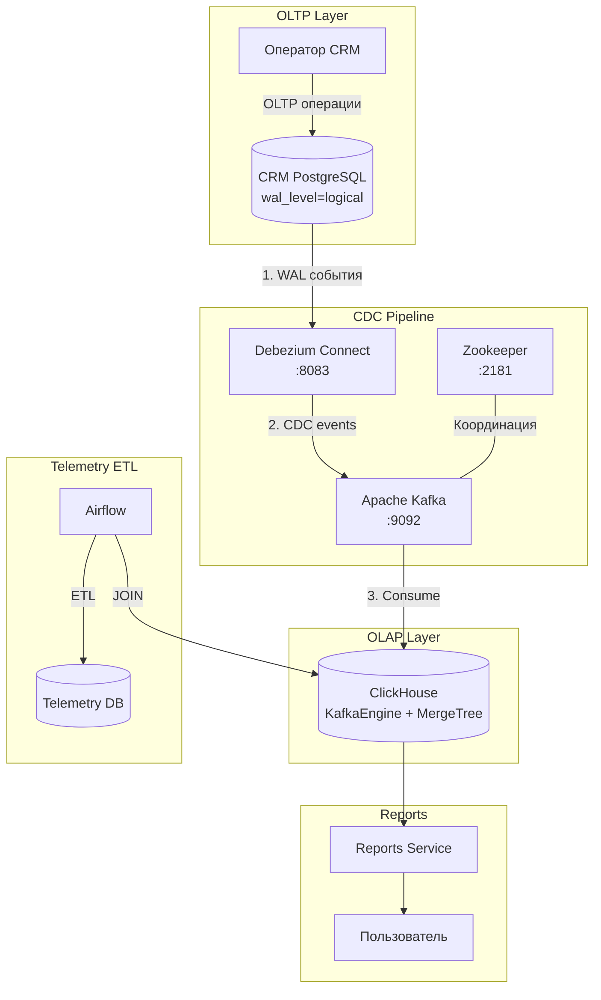
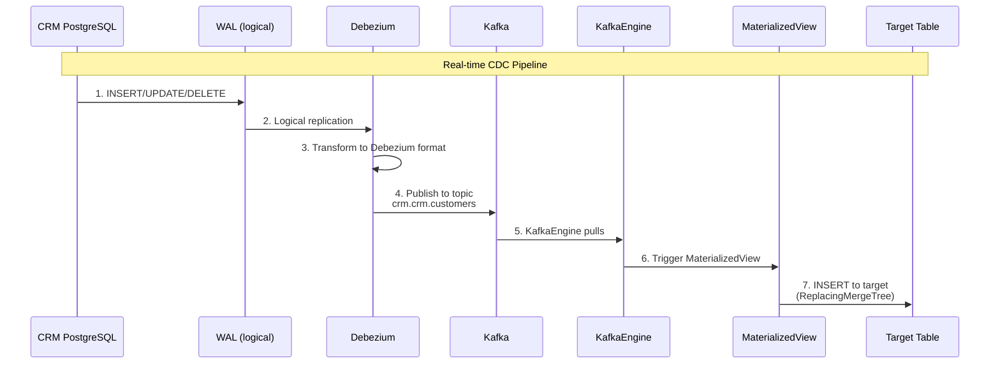

# CDC Pipeline Architecture (Task 4)

## Обзор

Задание 4 реализует Change Data Capture (CDC) для разделения OLTP/OLAP нагрузок и повышения стабильности работы CRM.

## Реализованные возможности

| Компонент | Описание |
|-----------|----------|
| **Debezium** | PostgreSQL CDC коннектор для CRM базы данных |
| **Kafka** | Message broker для потока CDC событий |
| **ClickHouse KafkaEngine** | Прямой приём данных из Kafka топиков |
| **MaterializedViews** | Автоматическая трансформация данных |
| **CDC ETL DAG** | Модифицированный pipeline, читающий из ClickHouse |

## Архитектурная диаграмма



## CDC Data Flow



## PostgreSQL CDC Setup

### WAL Configuration

```yaml
# docker-compose.yaml
crm_db:
  image: postgres:14
  command:
    - "postgres"
    - "-c"
    - "wal_level=logical"          # Включить logical replication
    - "-c"
    - "max_wal_senders=4"          # Макс. параллельных отправителей
    - "-c"
    - "max_replication_slots=4"    # Макс. слотов репликации
```

### Replication User

```sql
-- databases/crm_db_cdc_setup.sql
CREATE USER debezium_user WITH REPLICATION PASSWORD 'debezium_password';

GRANT SELECT ON ALL TABLES IN SCHEMA crm TO debezium_user;
GRANT USAGE ON SCHEMA crm TO debezium_user;

-- Публикация для Debezium
CREATE PUBLICATION crm_publication FOR TABLE
    crm.customers,
    crm.prostheses,
    crm.prosthesis_models;
```

## Debezium Configuration

### Connector Registration

```json
// debezium/crm-connector.json
{
  "name": "crm-connector",
  "config": {
    "connector.class": "io.debezium.connector.postgresql.PostgresConnector",
    "database.hostname": "crm_db",
    "database.port": "5432",
    "database.user": "debezium_user",
    "database.password": "debezium_password",
    "database.dbname": "crm_db",
    "database.server.name": "crm",
    "schema.include.list": "crm",
    "table.include.list": "crm.customers,crm.prostheses,crm.prosthesis_models",
    "plugin.name": "pgoutput",
    "publication.name": "crm_publication",
    "slot.name": "debezium_crm_slot",
    "topic.prefix": "crm",
    "key.converter": "org.apache.kafka.connect.json.JsonConverter",
    "value.converter": "org.apache.kafka.connect.json.JsonConverter",
    "key.converter.schemas.enable": "false",
    "value.converter.schemas.enable": "false",
    "transforms": "unwrap",
    "transforms.unwrap.type": "io.debezium.transforms.ExtractNewRecordState",
    "transforms.unwrap.drop.tombstones": "true"
  }
}
```

### Debezium Event Format

```json
{
  "before": null,
  "after": {
    "id": "550e8400-e29b-41d4-a716-446655440000",
    "name": "Ivan Petrov",
    "email": "ivan.petrov@bionicpro.com",
    "ldap_username": "ivan.petrov",
    "created_at": 1704067200000,
    "updated_at": 1704070800000
  },
  "source": {
    "version": "2.4.0.Final",
    "connector": "postgresql",
    "name": "crm",
    "ts_ms": 1704070800000,
    "db": "crm_db",
    "schema": "crm",
    "table": "customers"
  },
  "op": "c",  // c=create, u=update, d=delete, r=read (snapshot)
  "ts_ms": 1704070800000
}
```

## Kafka Configuration

### Topics

| Topic | Описание | Partitions | Retention |
|-------|----------|------------|-----------|
| `crm.crm.customers` | Изменения клиентов | 3 | 7 days |
| `crm.crm.prostheses` | Изменения протезов | 3 | 7 days |
| `crm.crm.prosthesis_models` | Изменения моделей | 1 | 7 days |

### Docker Configuration

```yaml
kafka:
  image: confluentinc/cp-kafka:7.5.0
  environment:
    KAFKA_BROKER_ID: 1
    KAFKA_ZOOKEEPER_CONNECT: zookeeper:2181
    KAFKA_ADVERTISED_LISTENERS: PLAINTEXT://kafka:29092,PLAINTEXT_HOST://localhost:9092
    KAFKA_OFFSETS_TOPIC_REPLICATION_FACTOR: 1
    KAFKA_AUTO_CREATE_TOPICS_ENABLE: "true"
```

## ClickHouse CDC Tables

### KafkaEngine Tables

```sql
-- clickhouse/init/02_cdc_kafka_tables.sql

-- Kafka Engine table for customers
CREATE TABLE IF NOT EXISTS reports.kafka_crm_customers (
    id UUID,
    name String,
    email String,
    ldap_username String,
    created_at DateTime64(3),
    updated_at DateTime64(3),
    __op String,
    __source_ts_ms Int64
)
ENGINE = Kafka()
SETTINGS
    kafka_broker_list = 'kafka:29092',
    kafka_topic_list = 'crm.crm.customers',
    kafka_group_name = 'clickhouse_customers',
    kafka_format = 'JSONEachRow',
    kafka_num_consumers = 1,
    kafka_skip_broken_messages = 100;
```

### Target Tables (ReplacingMergeTree)

```sql
-- Target table with deduplication
CREATE TABLE IF NOT EXISTS reports.crm_customers (
    id UUID,
    name String,
    email String,
    ldap_username String,
    created_at DateTime64(3),
    updated_at DateTime64(3),
    _version UInt64,
    _deleted UInt8 DEFAULT 0
)
ENGINE = ReplacingMergeTree(_version)
ORDER BY id;
```

### Materialized Views

```sql
-- Auto-insert from Kafka to target table
CREATE MATERIALIZED VIEW IF NOT EXISTS reports.mv_kafka_customers
TO reports.crm_customers
AS SELECT
    id,
    name,
    email,
    ldap_username,
    created_at,
    updated_at,
    __source_ts_ms as _version,
    CASE WHEN __op = 'd' THEN 1 ELSE 0 END as _deleted
FROM reports.kafka_crm_customers;
```

### CDC Data Mart View

```sql
-- Joined view for reports
CREATE VIEW IF NOT EXISTS reports.cdc_customer_data AS
SELECT
    c.id as customer_id,
    c.name as customer_name,
    c.email as customer_email,
    c.ldap_username,
    p.id as prosthesis_id,
    p.chip_id,
    m.name as prosthesis_model
FROM reports.crm_customers c FINAL
JOIN reports.crm_prostheses p FINAL ON c.id = p.customer_id
JOIN reports.crm_prosthesis_models m FINAL ON p.model_id = m.id
WHERE c._deleted = 0 AND p._deleted = 0;
```

## Hybrid Architecture

### CRM Data: CDC (Real-time)

```
CRM PostgreSQL → Debezium → Kafka → ClickHouse (KafkaEngine)
Latency: < 1 second
```

### Telemetry Data: ETL (Batch)

```
Telemetry PostgreSQL → Airflow ETL (каждые 15 мин) → ClickHouse
Latency: up to 15 minutes
```

### Reports Mart: JOIN

```sql
-- user_prosthesis_stats формируется из:
-- 1. CDC данных (crm_customers, crm_prostheses, crm_prosthesis_models)
-- 2. ETL данных (telemetry aggregates)
```

## CDC ETL DAG

```python
# airflow/dags/bionicpro_reports_cdc_etl.py

with DAG(
    dag_id='bionicpro_reports_cdc_etl',
    schedule_interval='*/15 * * * *',
) as dag:

    # Читаем CRM данные из ClickHouse (не из PostgreSQL!)
    extract_crm_from_ch = PythonOperator(
        task_id='extract_crm_from_clickhouse',
        python_callable=extract_crm_from_clickhouse,
    )

    extract_telemetry = PythonOperator(
        task_id='extract_telemetry_data',
        python_callable=extract_telemetry_data,
    )

    transform_and_join = PythonOperator(
        task_id='transform_and_join',
        python_callable=transform_and_join,
    )

    load = PythonOperator(
        task_id='load_to_clickhouse',
        python_callable=load_to_clickhouse,
    )

    [extract_crm_from_ch, extract_telemetry] >> transform_and_join >> load
```

## Benefits of CDC

### For CRM (OLTP)

| Аспект | До CDC | После CDC |
|--------|--------|-----------|
| ETL нагрузка | Тяжёлые SELECT каждые 15 мин | Нет нагрузки |
| Блокировки | Возможны при больших выгрузках | Отсутствуют |
| Производительность | Деградация при ETL | Стабильная |

### For Reports (OLAP)

| Аспект | До CDC | После CDC |
|--------|--------|-----------|
| Задержка данных | До 15 минут | < 1 секунды |
| Актуальность | Batch updates | Near real-time |
| Надёжность | Зависит от CRM | Независимо от CRM |

## Monitoring

### Debezium Status

```bash
# List connectors
curl http://localhost:8083/connectors

# Connector status
curl http://localhost:8083/connectors/crm-connector/status

# Connector tasks
curl http://localhost:8083/connectors/crm-connector/tasks/0/status
```

### Kafka UI

- URL: http://localhost:8084
- Topics: crm.crm.*
- Consumer groups: clickhouse_*

### ClickHouse CDC Health

```bash
# Проверка CDC таблиц
curl http://localhost:8001/health/cdc
```

Response:

```json
{
  "status": "healthy",
  "cdc_tables": {
    "crm_customers": {"rows": 5, "last_update": "2024-01-15T10:30:00Z"},
    "crm_prostheses": {"rows": 5, "last_update": "2024-01-15T10:30:00Z"},
    "crm_prosthesis_models": {"rows": 5, "last_update": "2024-01-15T10:30:00Z"}
  },
  "kafka_lag": {
    "crm.crm.customers": 0,
    "crm.crm.prostheses": 0
  }
}
```

## Troubleshooting

### Debezium не запускается

```bash
# Проверить логи
docker-compose logs debezium

# Проверить WAL level
docker-compose exec crm_db psql -U crm_user -d crm_db \
  -c "SHOW wal_level;"  # Должно быть 'logical'

# Проверить replication slot
docker-compose exec crm_db psql -U crm_user -d crm_db \
  -c "SELECT * FROM pg_replication_slots;"
```

### Данные не появляются в ClickHouse

```bash
# Проверить Kafka топики
docker-compose exec kafka kafka-console-consumer \
  --bootstrap-server localhost:9092 \
  --topic crm.crm.customers \
  --from-beginning --max-messages 1

# Проверить KafkaEngine
curl "http://localhost:8123/" -d "SELECT * FROM system.kafka_consumers"

# Проверить CDC таблицы
curl "http://localhost:8123/" -d "SELECT count() FROM reports.crm_customers"
```

### Connector failed

```bash
# Перезапуск коннектора
curl -X POST http://localhost:8083/connectors/crm-connector/restart

# Удаление и повторная регистрация
curl -X DELETE http://localhost:8083/connectors/crm-connector
curl -X POST -H "Content-Type: application/json" \
  --data @debezium/crm-connector.json \
  http://localhost:8083/connectors
```

## Debezium Admin API

| Method | Endpoint | Описание |
|--------|----------|----------|
| GET | `/connectors` | Список коннекторов |
| GET | `/connectors/{name}/status` | Статус коннектора |
| PUT | `/connectors/{name}/pause` | Приостановить |
| PUT | `/connectors/{name}/resume` | Возобновить |
| POST | `/connectors/{name}/restart` | Перезапустить |
| DELETE | `/connectors/{name}` | Удалить |

## См. также

- [Architecture Overview](overview.md)
- [Reports & ETL](reports-etl.md)
- [CDC Health API](../api/cdc-health.md)
