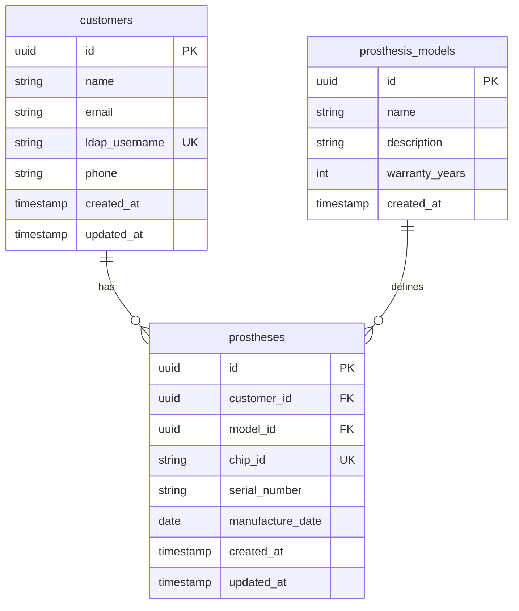
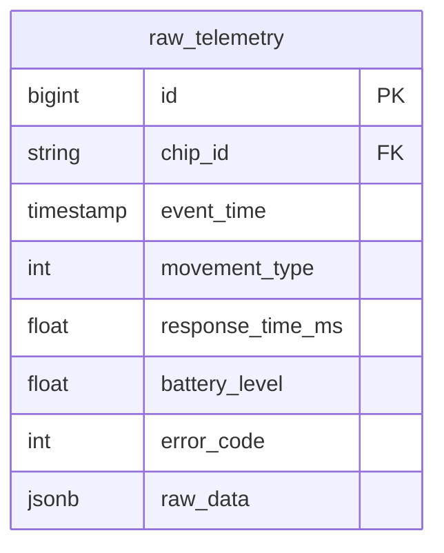
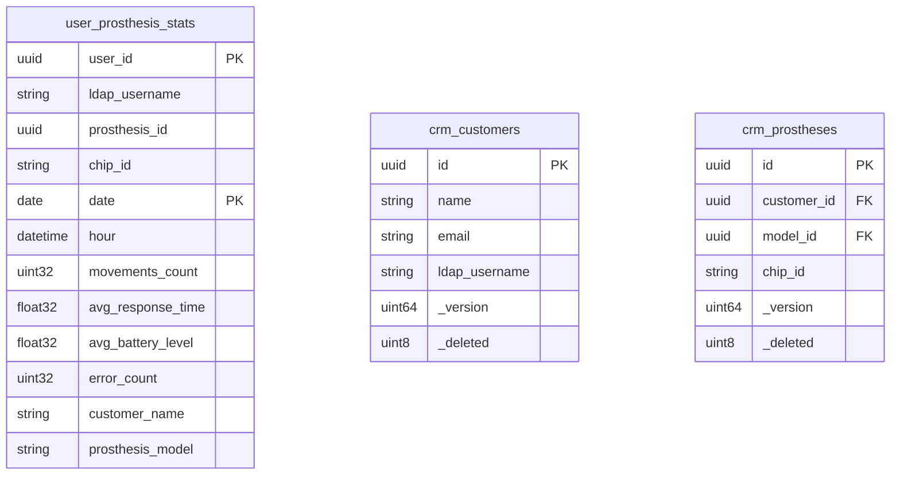
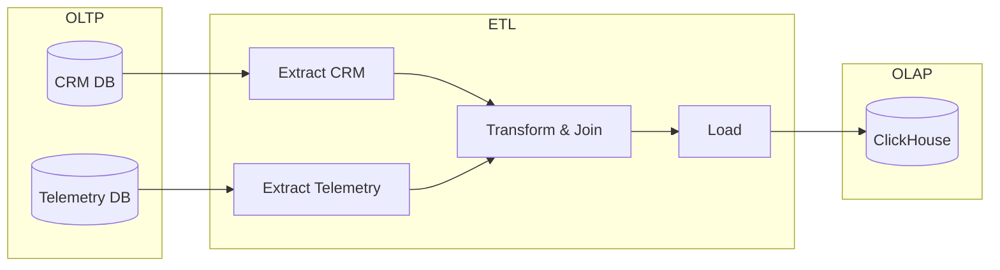
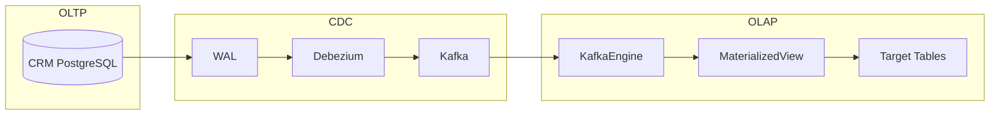

# Data Model

## Обзор

Система BionicPRO использует гибридную архитектуру данных:

- **OLTP (PostgreSQL)**: CRM данные, телеметрия
- **OLAP (ClickHouse)**: Витрина отчётов, CDC данные
- **Object Storage (MinIO S3)**: Кэшированные отчёты

## OLTP Layer (PostgreSQL)

### CRM Database



#### SQL Schema

```sql
-- databases/crm_db_init.sql

CREATE SCHEMA IF NOT EXISTS crm;

CREATE TABLE crm.customers (
    id UUID PRIMARY KEY DEFAULT gen_random_uuid(),
    name VARCHAR(255) NOT NULL,
    email VARCHAR(255) NOT NULL UNIQUE,
    ldap_username VARCHAR(100) UNIQUE,
    phone VARCHAR(50),
    created_at TIMESTAMP DEFAULT NOW(),
    updated_at TIMESTAMP DEFAULT NOW()
);

CREATE TABLE crm.prosthesis_models (
    id UUID PRIMARY KEY DEFAULT gen_random_uuid(),
    name VARCHAR(255) NOT NULL,
    description TEXT,
    warranty_years INTEGER DEFAULT 2,
    created_at TIMESTAMP DEFAULT NOW()
);

CREATE TABLE crm.prostheses (
    id UUID PRIMARY KEY DEFAULT gen_random_uuid(),
    customer_id UUID REFERENCES crm.customers(id),
    model_id UUID REFERENCES crm.prosthesis_models(id),
    chip_id VARCHAR(100) NOT NULL UNIQUE,
    serial_number VARCHAR(100) NOT NULL,
    manufacture_date DATE,
    created_at TIMESTAMP DEFAULT NOW(),
    updated_at TIMESTAMP DEFAULT NOW()
);

-- Indexes
CREATE INDEX idx_customers_ldap ON crm.customers(ldap_username);
CREATE INDEX idx_prostheses_chip ON crm.prostheses(chip_id);
CREATE INDEX idx_prostheses_customer ON crm.prostheses(customer_id);
```

### Telemetry Database



#### SQL Schema

```sql
-- databases/telemetry_db_init.sql

CREATE SCHEMA IF NOT EXISTS telemetry;

CREATE TABLE telemetry.raw_telemetry (
    id BIGSERIAL PRIMARY KEY,
    chip_id VARCHAR(100) NOT NULL,
    event_time TIMESTAMP NOT NULL DEFAULT NOW(),
    movement_type INTEGER,
    response_time_ms FLOAT,
    battery_level FLOAT,
    error_code INTEGER DEFAULT 0,
    raw_data JSONB,
    created_at TIMESTAMP DEFAULT NOW()
);

-- Partitioning by month for performance
CREATE INDEX idx_telemetry_chip_time
    ON telemetry.raw_telemetry(chip_id, event_time);
CREATE INDEX idx_telemetry_time
    ON telemetry.raw_telemetry(event_time);
```

## OLAP Layer (ClickHouse)

### Reports Database Schema



#### ClickHouse Schema

```sql
-- clickhouse/init/01_init_schema.sql

CREATE DATABASE IF NOT EXISTS reports;

-- Main reports table (ETL target)
CREATE TABLE IF NOT EXISTS reports.user_prosthesis_stats (
    user_id UUID,
    ldap_username String,
    prosthesis_id UUID,
    chip_id String,
    date Date,
    hour DateTime,
    movements_count UInt32,
    avg_response_time Float32,
    avg_battery_level Float32,
    error_count UInt32,
    error_rate Float32,
    customer_name String,
    customer_email String,
    prosthesis_model String,
    created_at DateTime DEFAULT now()
)
ENGINE = MergeTree()
PARTITION BY toYYYYMM(date)
ORDER BY (ldap_username, date, hour)
TTL date + INTERVAL 365 DAY;
```

### CDC Tables

```sql
-- clickhouse/init/02_cdc_kafka_tables.sql

-- CDC target tables (ReplacingMergeTree for deduplication)
CREATE TABLE IF NOT EXISTS reports.crm_customers (
    id UUID,
    name String,
    email String,
    ldap_username String,
    created_at DateTime64(3),
    updated_at DateTime64(3),
    _version UInt64,
    _deleted UInt8 DEFAULT 0
)
ENGINE = ReplacingMergeTree(_version)
ORDER BY id;

CREATE TABLE IF NOT EXISTS reports.crm_prostheses (
    id UUID,
    customer_id UUID,
    model_id UUID,
    chip_id String,
    serial_number String,
    created_at DateTime64(3),
    updated_at DateTime64(3),
    _version UInt64,
    _deleted UInt8 DEFAULT 0
)
ENGINE = ReplacingMergeTree(_version)
ORDER BY id;

CREATE TABLE IF NOT EXISTS reports.crm_prosthesis_models (
    id UUID,
    name String,
    description String,
    warranty_years UInt8,
    created_at DateTime64(3),
    _version UInt64,
    _deleted UInt8 DEFAULT 0
)
ENGINE = ReplacingMergeTree(_version)
ORDER BY id;
```

### Materialized Views for CDC

```sql
-- Auto-insert from Kafka to target tables
CREATE MATERIALIZED VIEW IF NOT EXISTS reports.mv_kafka_customers
TO reports.crm_customers
AS SELECT
    JSONExtractString(_raw, 'id') as id,
    JSONExtractString(_raw, 'name') as name,
    JSONExtractString(_raw, 'email') as email,
    JSONExtractString(_raw, 'ldap_username') as ldap_username,
    fromUnixTimestamp64Milli(JSONExtractInt(_raw, '__source_ts_ms')) as created_at,
    fromUnixTimestamp64Milli(JSONExtractInt(_raw, '__source_ts_ms')) as updated_at,
    JSONExtractInt(_raw, '__source_ts_ms') as _version,
    if(JSONExtractString(_raw, '__op') = 'd', 1, 0) as _deleted
FROM reports.kafka_crm_customers;
```

### CDC Data Mart View

```sql
-- Joined view combining CDC data
CREATE VIEW IF NOT EXISTS reports.cdc_customer_data AS
SELECT
    c.id as customer_id,
    c.name as customer_name,
    c.email as customer_email,
    c.ldap_username,
    p.id as prosthesis_id,
    p.chip_id,
    m.name as prosthesis_model
FROM reports.crm_customers c FINAL
JOIN reports.crm_prostheses p FINAL ON c.id = p.customer_id
JOIN reports.crm_prosthesis_models m FINAL ON p.model_id = m.id
WHERE c._deleted = 0 AND p._deleted = 0;
```

## Data Flow

### ETL Pipeline



### CDC Pipeline



## Partitioning & TTL

### ClickHouse Partitioning

| Table | Partition Key | Order Key | TTL |
|-------|---------------|-----------|-----|
| user_prosthesis_stats | toYYYYMM(date) | (ldap_username, date, hour) | 365 days |
| crm_customers | - | id | - |
| crm_prostheses | - | id | - |

### PostgreSQL Considerations

Для больших объёмов телеметрии рекомендуется:

```sql
-- Партиционирование по месяцам
CREATE TABLE telemetry.raw_telemetry_2024_01
    PARTITION OF telemetry.raw_telemetry
    FOR VALUES FROM ('2024-01-01') TO ('2024-02-01');
```

## Sample Queries

### Отчёты пользователя

```sql
-- Список доступных отчётов
SELECT DISTINCT date
FROM reports.user_prosthesis_stats
WHERE ldap_username = 'ivan.petrov'
ORDER BY date DESC
LIMIT 30;

-- Детальный отчёт за дату
SELECT
    hour,
    movements_count,
    avg_response_time,
    avg_battery_level,
    error_count,
    prosthesis_model
FROM reports.user_prosthesis_stats
WHERE ldap_username = 'ivan.petrov'
  AND date = '2024-01-15'
ORDER BY hour;
```

### CDC данные

```sql
-- Текущее состояние клиентов (с дедупликацией)
SELECT * FROM reports.crm_customers FINAL
WHERE _deleted = 0;

-- Объединённые данные для отчётов
SELECT * FROM reports.cdc_customer_data
WHERE ldap_username = 'ivan.petrov';
```

### Статистика системы

```sql
-- Размер таблиц
SELECT
    table,
    formatReadableSize(sum(bytes)) as size,
    sum(rows) as rows
FROM system.parts
WHERE database = 'reports' AND active
GROUP BY table;

-- Kafka consumer lag
SELECT * FROM system.kafka_consumers;
```

## Data Retention

| Data Type | Storage | Retention |
|-----------|---------|-----------|
| Reports (OLAP) | ClickHouse | 365 days (TTL) |
| CDC data | ClickHouse | Indefinite |
| Telemetry (OLTP) | PostgreSQL | 90 days |
| Cached reports | MinIO S3 | Until invalidation |
| Session data | Redis | 24 hours |

## См. также

- [Reports & ETL Architecture](reports-etl.md)
- [CDC Pipeline](cdc.md)
- [Architecture Overview](overview.md)
