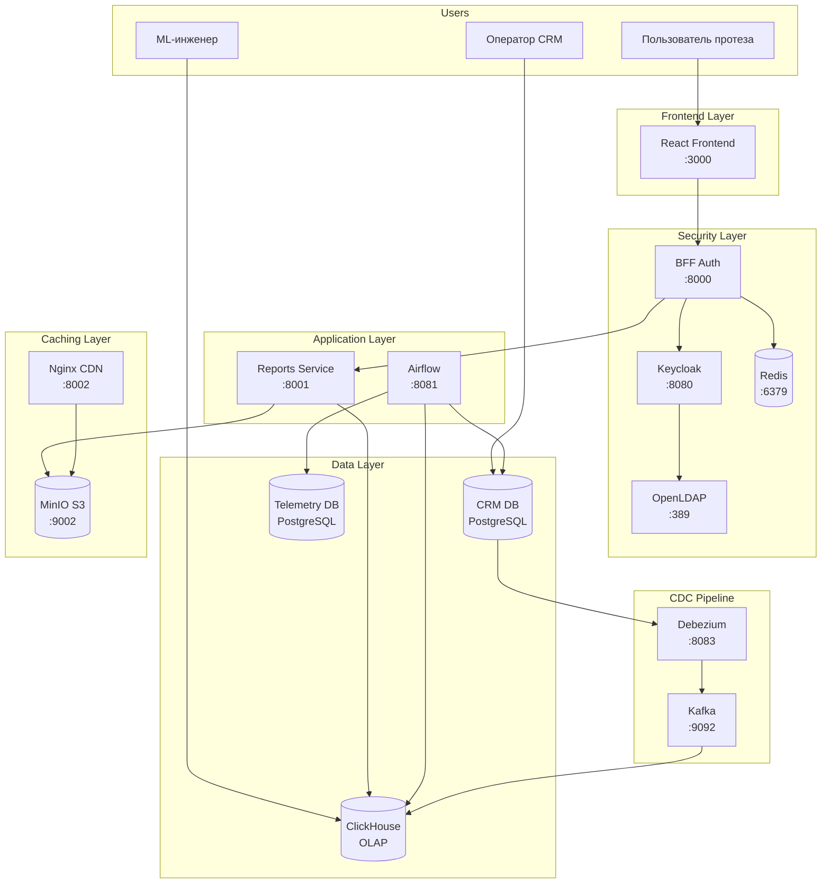
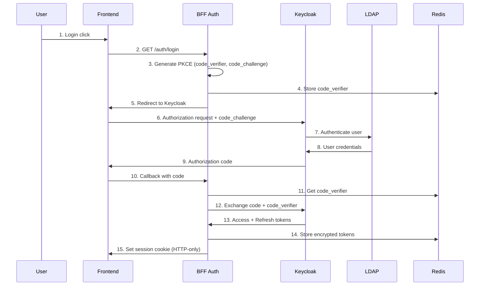
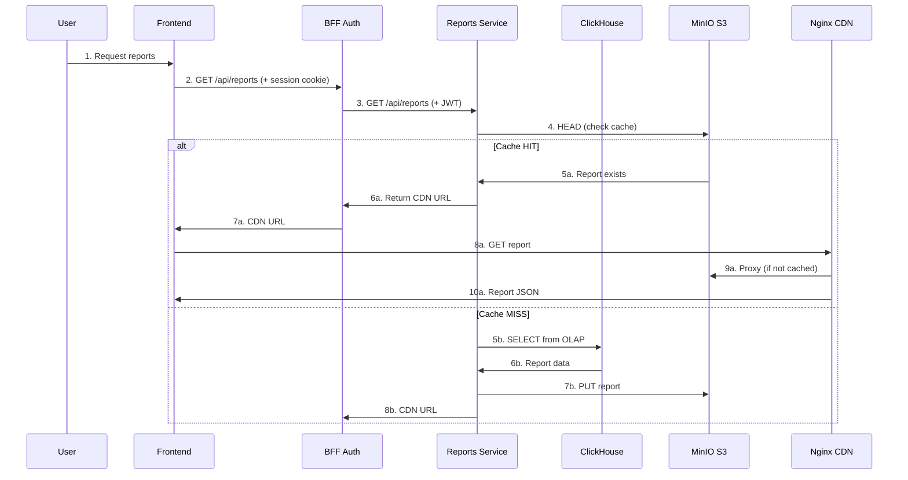
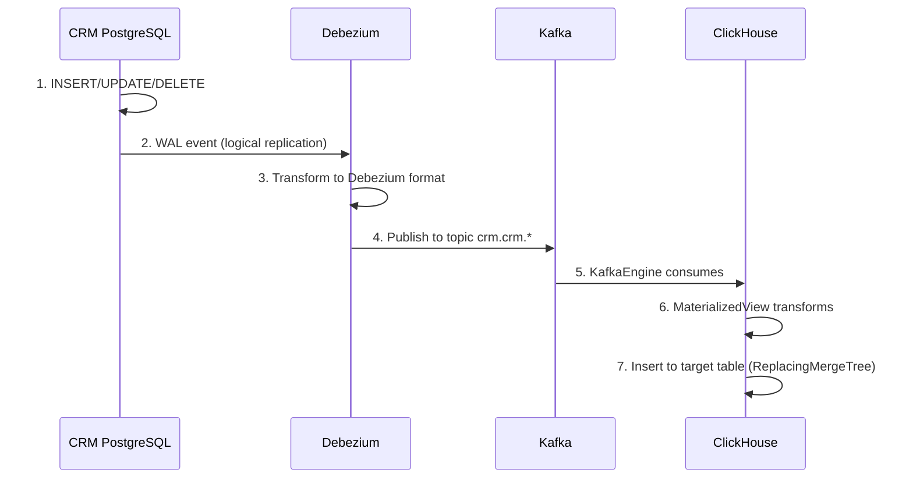

# Architecture Overview

## Обзор системы BionicPRO

BionicPRO — платформа для управления бионическими протезами, включающая:

- Сбор телеметрии с протезов в реальном времени
- Формирование отчётов для пользователей
- Управление заказами через CRM
- Безопасную аутентификацию с MFA

## Архитектурные решения

Система построена по принципам:

1. **Разделение OLTP/OLAP нагрузок** — CRM работает с PostgreSQL, отчёты формируются из ClickHouse
2. **BFF Pattern** — токены хранятся на сервере, фронтенд работает только с session cookies
3. **CDC для real-time данных** — изменения в CRM автоматически реплицируются в OLAP
4. **Многоуровневое кэширование** — Redis + S3 + Nginx CDN

## Диаграмма компонентов

## Слои архитектуры

### 1. Presentation Layer (Frontend)

| Компонент | Технология | Порт | Описание |
|-----------|------------|------|----------|
| Frontend | React 18 + TypeScript | 3000 | SPA для пользователей протезов |
| Nginx CDN | Nginx 1.25 | 8002 | Reverse proxy с кэшированием |

### 2. Security Layer

| Компонент | Технология | Порт | Описание |
|-----------|------------|------|----------|
| Keycloak | Keycloak 26.5.2 | 8080 | Identity Provider, MFA, Identity Brokering |
| OpenLDAP | OpenLDAP 1.5.0 | 389 | Directory Service для User Federation |
| BFF Auth | Python/Flask | 8000 | Backend-for-Frontend, хранение токенов |
| Redis | Redis 7 | 6379 | Session Storage |

### 3. Application Layer

| Компонент | Технология | Порт | Описание |
|-----------|------------|------|----------|
| Reports Service | Python/FastAPI | 8001 | REST API для отчётов |
| Apache Airflow | Airflow 2.8.1 | 8081 | ETL оркестратор |

### 4. Data Layer

| Компонент | Технология | Порт | Описание |
|-----------|------------|------|----------|
| CRM DB | PostgreSQL 14 | 5435 | OLTP база клиентов и заказов |
| Telemetry DB | PostgreSQL 14 | 5436 | OLTP база телеметрии |
| ClickHouse | ClickHouse 24.1 | 8123/9000 | OLAP витрина отчётов |
| MinIO | MinIO S3 | 9002 | Object Storage для отчётов |

### 5. CDC Pipeline

| Компонент | Технология | Порт | Описание |
|-----------|------------|------|----------|
| Debezium | Debezium Connect | 8083 | CDC коннектор для PostgreSQL |
| Kafka | Apache Kafka 3.6 | 9092 | Message Broker |
| Zookeeper | Apache Zookeeper | 2181 | Координатор Kafka |

## Потоки данных

### Поток аутентификации

### Поток получения отчётов

### Поток CDC

## Принципы безопасности

### Защита токенов (BFF Pattern)

- Access/Refresh токены **никогда** не передаются на фронтенд
- Токены хранятся в Redis в зашифрованном виде (Fernet)
- Фронтенд работает только с HTTP-only, Secure session cookies
- Автоматическая ротация session ID для защиты от session fixation

### Многофакторная аутентификация

- Обязательный TOTP для всех пользователей
- Настройка через Keycloak Admin Console
- Поддержка Google Authenticator, Authy и др.

### Локализация данных

- Персональные данные остаются в локальных БД представительств
- Keycloak синхронизирует только аутентификационные атрибуты
- User Federation с отдельными LDAP серверами для РФ и Европы

## Следующие шаги

- [Security Architecture](security.md) — детальное описание безопасности
- [Reports & ETL](reports-etl.md) — ETL pipeline и Reports Service
- [S3/CDN Caching](s3-cdn.md) — архитектура кэширования
- [CDC Pipeline](cdc.md) — Change Data Capture
