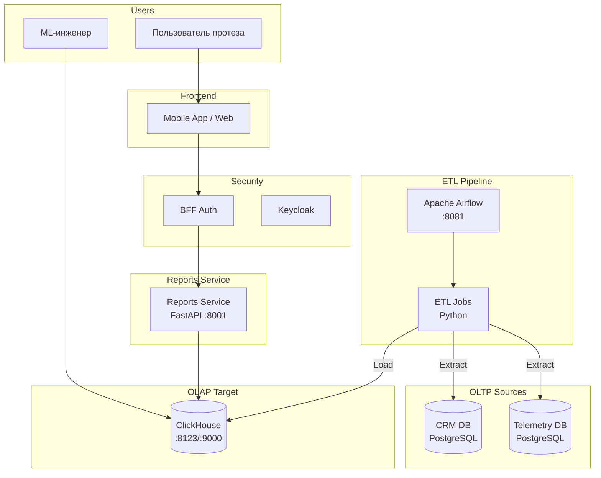
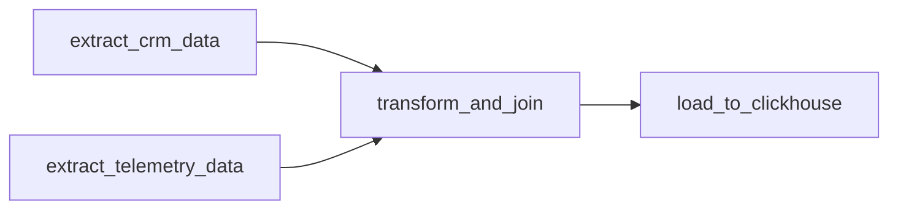

# Reports & ETL Architecture (Task 2)

## Обзор

Задание 2 реализует ETL pipeline и Reports API для данных об использовании протезов.

## Реализованные возможности

| Компонент | Описание |
|-----------|----------|
| **Apache Airflow** | Оркестратор ETL-процессов с расписанием |
| **ClickHouse OLAP** | Аналитическая база данных с партиционированной витриной |
| **Reports Service** | FastAPI REST API для отчётов |
| **JWT Authentication** | Защита API через валидацию токенов Keycloak |

## Архитектурная диаграмма



## ETL Pipeline

### DAG: bionicpro_reports_etl

```python
# airflow/dags/bionicpro_reports_etl.py
from airflow import DAG
from airflow.operators.python import PythonOperator
from datetime import datetime, timedelta

default_args = {
    'owner': 'bionicpro',
    'depends_on_past': False,
    'retries': 3,
    'retry_delay': timedelta(minutes=5),
}

with DAG(
    dag_id='bionicpro_reports_etl',
    default_args=default_args,
    description='ETL pipeline for prosthesis usage reports',
    schedule_interval='*/15 * * * *',  # Каждые 15 минут
    start_date=datetime(2024, 1, 1),
    catchup=False,
) as dag:

    extract_crm = PythonOperator(
        task_id='extract_crm_data',
        python_callable=extract_crm_data,
    )

    extract_telemetry = PythonOperator(
        task_id='extract_telemetry_data',
        python_callable=extract_telemetry_data,
    )

    transform = PythonOperator(
        task_id='transform_and_join',
        python_callable=transform_and_join,
    )

    load = PythonOperator(
        task_id='load_to_clickhouse',
        python_callable=load_to_clickhouse,
    )

    [extract_crm, extract_telemetry] >> transform >> load
```

### Визуализация DAG



### ETL Tasks

#### 1. Extract CRM Data

```python
def extract_crm_data(**context):
    """Извлечение данных клиентов и протезов из CRM"""
    query = """
    SELECT
        c.id as customer_id,
        c.name as customer_name,
        c.email,
        c.ldap_username,
        p.id as prosthesis_id,
        p.chip_id,
        pm.name as prosthesis_model
    FROM crm.customers c
    JOIN crm.prostheses p ON c.id = p.customer_id
    JOIN crm.prosthesis_models pm ON p.model_id = pm.id
    WHERE c.updated_at >= NOW() - INTERVAL '7 days'
    """
    # Execute and return DataFrame
```

#### 2. Extract Telemetry Data

```python
def extract_telemetry_data(**context):
    """Извлечение агрегированных данных телеметрии"""
    query = """
    SELECT
        chip_id,
        DATE_TRUNC('hour', event_time) as hour,
        COUNT(*) as movements_count,
        AVG(response_time_ms) as avg_response_time,
        AVG(battery_level) as avg_battery_level,
        SUM(CASE WHEN error_code > 0 THEN 1 ELSE 0 END) as error_count
    FROM telemetry.raw_telemetry
    WHERE event_time >= NOW() - INTERVAL '7 days'
    GROUP BY chip_id, DATE_TRUNC('hour', event_time)
    """
```

#### 3. Transform and Join

```python
def transform_and_join(**context):
    """Объединение и трансформация данных"""
    ti = context['ti']
    crm_data = ti.xcom_pull(task_ids='extract_crm_data')
    telemetry_data = ti.xcom_pull(task_ids='extract_telemetry_data')

    # JOIN по chip_id
    merged = pd.merge(
        telemetry_data,
        crm_data,
        on='chip_id',
        how='inner'
    )

    # Расчёт дополнительных метрик
    merged['error_rate'] = merged['error_count'] / merged['movements_count']
    merged['date'] = merged['hour'].dt.date

    return merged
```

#### 4. Load to ClickHouse

```python
def load_to_clickhouse(**context):
    """Загрузка данных в ClickHouse"""
    ti = context['ti']
    data = ti.xcom_pull(task_ids='transform_and_join')

    client = clickhouse_connect.get_client(
        host='clickhouse',
        port=9000,
        database='reports'
    )

    client.insert(
        'user_prosthesis_stats',
        data.values.tolist(),
        column_names=list(data.columns)
    )
```

## ClickHouse Schema

### Витрина отчётов

```sql
-- clickhouse/init/01_init_schema.sql

CREATE DATABASE IF NOT EXISTS reports;

CREATE TABLE IF NOT EXISTS reports.user_prosthesis_stats (
    -- Идентификаторы
    user_id UUID,
    ldap_username String,
    prosthesis_id UUID,
    chip_id String,

    -- Временные метки
    date Date,
    hour DateTime,

    -- Метрики телеметрии
    movements_count UInt32,
    avg_response_time Float32,
    avg_battery_level Float32,
    error_count UInt32,
    error_rate Float32,

    -- Данные клиента
    customer_name String,
    customer_email String,
    prosthesis_model String,

    -- Метаданные
    created_at DateTime DEFAULT now()
)
ENGINE = MergeTree()
PARTITION BY toYYYYMM(date)
ORDER BY (user_id, date, hour)
TTL date + INTERVAL 365 DAY;
```

### Индексы и оптимизация

```sql
-- Создание проекций для быстрых агрегаций
ALTER TABLE reports.user_prosthesis_stats
ADD PROJECTION daily_stats (
    SELECT
        user_id,
        date,
        sum(movements_count) as total_movements,
        avg(avg_response_time) as avg_response_time,
        avg(avg_battery_level) as avg_battery_level
    GROUP BY user_id, date
);
```

## Reports Service

### API Endpoints

| Method | Endpoint | Описание |
|--------|----------|----------|
| GET | `/api/reports` | Список отчётов пользователя |
| GET | `/api/reports/summary` | Сводная статистика |
| GET | `/api/reports/{date}` | Детальный отчёт за дату |
| GET | `/health` | Health check |
| GET | `/health/live` | Liveness probe |

### Архитектура сервиса

```python
# reports-service/app/main.py
from fastapi import FastAPI, Depends, HTTPException
from app.auth.jwt_handler import get_current_user
from app.services.clickhouse_service import ClickHouseService

app = FastAPI(title="BionicPRO Reports Service")

@app.get("/api/reports")
async def get_reports(
    user: dict = Depends(get_current_user),
    ch: ClickHouseService = Depends()
):
    """Получить список отчётов текущего пользователя"""
    username = user.get("preferred_username")
    return await ch.get_user_reports(username)

@app.get("/api/reports/{date}")
async def get_report_by_date(
    date: str,
    user: dict = Depends(get_current_user),
    ch: ClickHouseService = Depends()
):
    """Получить детальный отчёт за конкретную дату"""
    username = user.get("preferred_username")
    return await ch.get_report_by_date(username, date)
```

### JWT Validation

```python
# reports-service/app/auth/jwt_handler.py
from jose import jwt, JWTError
from fastapi import HTTPException, Security
from fastapi.security import HTTPBearer

security = HTTPBearer()

async def get_current_user(credentials = Security(security)):
    token = credentials.credentials
    try:
        # Валидация JWT через Keycloak public key
        payload = jwt.decode(
            token,
            key=KEYCLOAK_PUBLIC_KEY,
            algorithms=["RS256"],
            audience="bionicpro-auth"
        )
        return payload
    except JWTError:
        raise HTTPException(status_code=401, detail="Invalid token")
```

### ClickHouse Service

```python
# reports-service/app/services/clickhouse_service.py
import clickhouse_connect

class ClickHouseService:
    def __init__(self):
        self.client = clickhouse_connect.get_client(
            host=os.getenv("CLICKHOUSE_HOST", "clickhouse"),
            port=int(os.getenv("CLICKHOUSE_PORT", 9000)),
            database=os.getenv("CLICKHOUSE_DATABASE", "reports")
        )

    async def get_user_reports(self, username: str):
        query = """
        SELECT DISTINCT date
        FROM reports.user_prosthesis_stats
        WHERE ldap_username = %(username)s
        ORDER BY date DESC
        LIMIT 30
        """
        return self.client.query(query, parameters={"username": username})

    async def get_report_by_date(self, username: str, date: str):
        query = """
        SELECT
            hour,
            movements_count,
            avg_response_time,
            avg_battery_level,
            error_count,
            prosthesis_model
        FROM reports.user_prosthesis_stats
        WHERE ldap_username = %(username)s
          AND date = %(date)s
        ORDER BY hour
        """
        return self.client.query(
            query,
            parameters={"username": username, "date": date}
        )
```

## Response Examples

### GET /api/reports

```json
{
  "reports": [
    {"date": "2024-01-15"},
    {"date": "2024-01-14"},
    {"date": "2024-01-13"}
  ],
  "total": 3,
  "user": "ivan.petrov"
}
```

### GET /api/reports/2024-01-15

```json
{
  "date": "2024-01-15",
  "user": "ivan.petrov",
  "prosthesis_model": "BionicHand Pro X1",
  "summary": {
    "total_movements": 1523,
    "avg_response_time_ms": 45.2,
    "avg_battery_level": 78.5,
    "total_errors": 3,
    "uptime_hours": 14
  },
  "hourly_data": [
    {
      "hour": "2024-01-15T08:00:00",
      "movements_count": 145,
      "avg_response_time": 42.1,
      "battery_level": 95.0,
      "error_count": 0
    },
    {
      "hour": "2024-01-15T09:00:00",
      "movements_count": 189,
      "avg_response_time": 44.3,
      "battery_level": 92.0,
      "error_count": 1
    }
  ]
}
```

## Airflow Connections

ETL использует следующие Airflow Connections:

| Connection ID | Type | Host | Database |
|---------------|------|------|----------|
| bionicpro_crm_db | PostgreSQL | crm_db | crm_db |
| bionicpro_telemetry_db | PostgreSQL | telemetry_db | telemetry_db |
| bionicpro_clickhouse | Generic | clickhouse | reports |

```bash
# Создание connections
airflow connections add 'bionicpro_crm_db' \
  --conn-type 'postgres' \
  --conn-host 'crm_db' \
  --conn-schema 'crm_db' \
  --conn-login 'crm_user' \
  --conn-password 'crm_password' \
  --conn-port '5432'
```

## Monitoring

### Airflow UI

- URL: http://localhost:8081
- Credentials: admin / admin

### DAG Metrics

```bash
# Статус DAG
docker-compose exec airflow-webserver airflow dags list

# История запусков
docker-compose exec airflow-webserver airflow dags list-runs -d bionicpro_reports_etl

# Ручной запуск
docker-compose exec airflow-webserver airflow dags trigger bionicpro_reports_etl
```

### ClickHouse Queries

```sql
-- Проверка данных в витрине
SELECT count() FROM reports.user_prosthesis_stats;

-- Данные по пользователю
SELECT *
FROM reports.user_prosthesis_stats
WHERE ldap_username = 'ivan.petrov'
ORDER BY date DESC, hour DESC
LIMIT 10;
```

## См. также

- [Architecture Overview](overview.md)
- [S3/CDN Caching](s3-cdn.md)
- [CDC Pipeline](cdc.md)
- [Reports API Reference](../api/reports.md)
