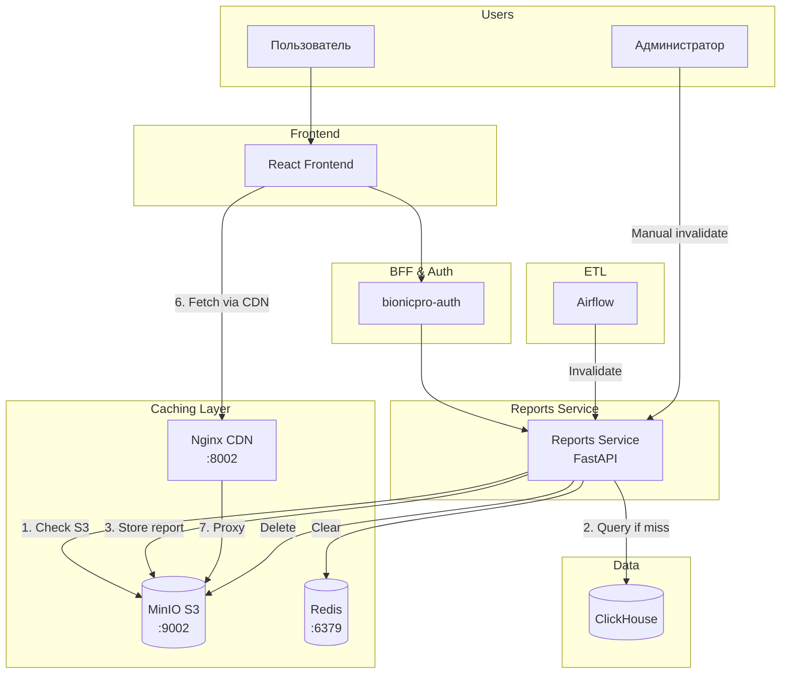
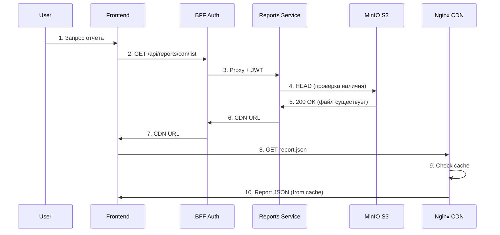
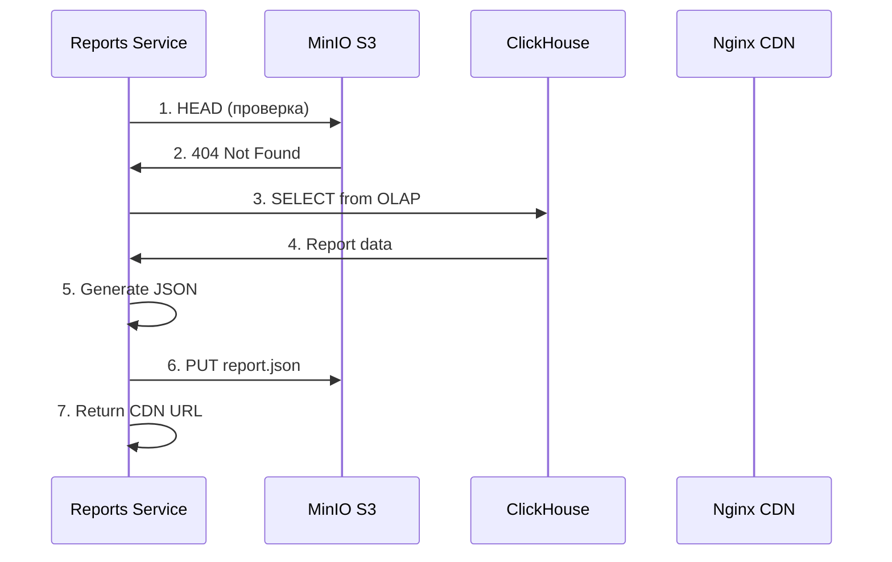

# S3/CDN Caching Architecture (Task 3)

## Обзор

Задание 3 реализует кэширование отчётов с использованием S3 хранилища и CDN для снижения нагрузки на базу данных.

## Реализованные возможности

| Компонент | Описание |
|-----------|----------|
| **MinIO** | S3-совместимое объектное хранилище для JSON отчётов |
| **Nginx CDN** | Reverse proxy с HTTP кэшированием |
| **Cache Invalidation** | TTL-based и ETL-triggered инвалидация кэша |
| **CDN URLs** | Прямые ссылки на закэшированные отчёты |

## Архитектурная диаграмма



## Request Flow

### Cache HIT (Fast Path)



### Cache MISS



## S3 Storage Structure

```
reports-bucket/
├── {user_id}/
│   ├── list/
│   │   └── reports.json          # Список доступных отчётов
│   ├── summary/
│   │   └── summary.json          # Сводная статистика
│   └── daily/
│       ├── 2024-01-15/
│       │   └── report.json       # Детальный отчёт за дату
│       ├── 2024-01-14/
│       │   └── report.json
│       └── ...
```

### Пример reports.json

```json
{
  "user_id": "550e8400-e29b-41d4-a716-446655440000",
  "username": "ivan.petrov",
  "generated_at": "2024-01-15T10:30:00Z",
  "reports": [
    {
      "date": "2024-01-15",
      "cdn_url": "http://localhost:8002/reports/550e8400.../daily/2024-01-15/report.json"
    },
    {
      "date": "2024-01-14",
      "cdn_url": "http://localhost:8002/reports/550e8400.../daily/2024-01-14/report.json"
    }
  ]
}
```

## MinIO Configuration

### Docker Compose

```yaml
minio:
  image: minio/minio:RELEASE.2024-01-18T22-51-28Z
  environment:
    MINIO_ROOT_USER: minioadmin
    MINIO_ROOT_PASSWORD: minioadmin123
  volumes:
    - ./minio-data:/data
  ports:
    - "9001:9001"   # Console UI
    - "9002:9000"   # S3 API
  command: server /data --console-address ":9001"
```

### Bucket Initialization

```bash
# minio-init service
mc alias set myminio http://minio:9000 minioadmin minioadmin123
mc mb myminio/reports-bucket --ignore-existing
mc anonymous set download myminio/reports-bucket
```

## Nginx CDN Configuration

```nginx
# nginx-cdn/nginx.conf
worker_processes auto;

events {
    worker_connections 1024;
}

http {
    # Cache configuration
    proxy_cache_path /var/cache/nginx
        levels=1:2
        keys_zone=reports_cache:10m
        max_size=1g
        inactive=5m
        use_temp_path=off;

    server {
        listen 80;

        # Health check
        location /health {
            return 200 'OK';
            add_header Content-Type text/plain;
        }

        # Reports proxy with caching
        location /reports/ {
            proxy_pass http://minio:9000/reports-bucket/;

            # Cache settings
            proxy_cache reports_cache;
            proxy_cache_valid 200 5m;
            proxy_cache_valid 404 1m;
            proxy_cache_use_stale error timeout updating;
            proxy_cache_lock on;

            # Cache status header
            add_header X-Cache-Status $upstream_cache_status;

            # CORS headers
            add_header Access-Control-Allow-Origin *;
            add_header Access-Control-Allow-Methods 'GET, OPTIONS';
            add_header Access-Control-Allow-Headers 'Content-Type';

            # Compression
            gzip on;
            gzip_types application/json;
        }
    }
}
```

### Cache Headers

| Header | Значение | Описание |
|--------|----------|----------|
| `X-Cache-Status` | HIT/MISS/EXPIRED | Статус кэша |
| `Cache-Control` | max-age=300 | TTL 5 минут |
| `ETag` | hash | Для conditional requests |

## Reports Service Implementation

### S3 Client

```python
# reports-service/app/services/s3_service.py
import boto3
from botocore.config import Config

class S3Service:
    def __init__(self):
        self.client = boto3.client(
            's3',
            endpoint_url=os.getenv('S3_ENDPOINT_URL', 'http://minio:9000'),
            aws_access_key_id=os.getenv('S3_ACCESS_KEY', 'minioadmin'),
            aws_secret_access_key=os.getenv('S3_SECRET_KEY', 'minioadmin123'),
            config=Config(signature_version='s3v4'),
            region_name=os.getenv('S3_REGION', 'us-east-1')
        )
        self.bucket = os.getenv('S3_BUCKET_NAME', 'reports-bucket')

    def check_exists(self, key: str) -> bool:
        """Проверить существование объекта"""
        try:
            self.client.head_object(Bucket=self.bucket, Key=key)
            return True
        except:
            return False

    def put_report(self, key: str, data: dict) -> str:
        """Сохранить отчёт в S3"""
        self.client.put_object(
            Bucket=self.bucket,
            Key=key,
            Body=json.dumps(data, ensure_ascii=False),
            ContentType='application/json'
        )
        return self.get_cdn_url(key)

    def delete_report(self, key: str):
        """Удалить отчёт из S3"""
        self.client.delete_object(Bucket=self.bucket, Key=key)

    def get_cdn_url(self, key: str) -> str:
        """Получить CDN URL для объекта"""
        cdn_base = os.getenv('CDN_BASE_URL', 'http://localhost:8002')
        return f"{cdn_base}/reports/{key}"
```

### CDN Endpoints

```python
# reports-service/app/main.py

@app.get("/api/reports/cdn/list")
async def get_reports_cdn(
    user: dict = Depends(get_current_user),
    s3: S3Service = Depends(),
    ch: ClickHouseService = Depends()
):
    """Получить CDN URL для списка отчётов"""
    user_id = user.get("sub")
    key = f"{user_id}/list/reports.json"

    if not s3.check_exists(key):
        # Cache miss - генерируем отчёт
        reports = await ch.get_user_reports(user.get("preferred_username"))
        cdn_url = s3.put_report(key, reports)
    else:
        cdn_url = s3.get_cdn_url(key)

    return {"cdn_url": cdn_url}

@app.get("/api/reports/cdn/{date}")
async def get_report_cdn(
    date: str,
    user: dict = Depends(get_current_user),
    s3: S3Service = Depends(),
    ch: ClickHouseService = Depends()
):
    """Получить CDN URL для отчёта за дату"""
    user_id = user.get("sub")
    key = f"{user_id}/daily/{date}/report.json"

    if not s3.check_exists(key):
        report = await ch.get_report_by_date(
            user.get("preferred_username"), date
        )
        cdn_url = s3.put_report(key, report)
    else:
        cdn_url = s3.get_cdn_url(key)

    return {"cdn_url": cdn_url, "date": date}
```

## Cache Invalidation

### After ETL

```python
# airflow/dags/bionicpro_reports_etl.py

def invalidate_cache(**context):
    """Инвалидация кэша после ETL"""
    import requests

    # Получить список user_ids, для которых обновились данные
    user_ids = context['ti'].xcom_pull(task_ids='load_to_clickhouse')

    # Вызвать инвалидацию для каждого пользователя
    for user_id in user_ids:
        requests.post(
            'http://reports-service:8001/api/reports/invalidate',
            json={'user_id': user_id}
        )
```

### Invalidation Endpoint

```python
@app.post("/api/reports/invalidate")
async def invalidate_cache(
    request: InvalidateRequest,
    s3: S3Service = Depends(),
    redis: Redis = Depends()
):
    """Инвалидация кэша для пользователя"""
    user_id = request.user_id

    # Удалить объекты из S3
    s3.delete_prefix(f"{user_id}/")

    # Очистить Redis кэш
    pattern = f"report:{user_id}:*"
    keys = redis.keys(pattern)
    if keys:
        redis.delete(*keys)

    # CDN кэш истечёт по TTL (5 минут)

    return {"status": "invalidated", "user_id": user_id}
```

## CDN API Endpoints

| Method | Endpoint | Описание |
|--------|----------|----------|
| GET | `/api/reports/cdn/list` | CDN URL для списка отчётов |
| GET | `/api/reports/cdn/summary` | CDN URL для сводки |
| GET | `/api/reports/cdn/{date}` | CDN URL для отчёта за дату |
| POST | `/api/reports/invalidate` | Инвалидация кэша (admin) |

## Performance Benefits

### Без кэширования

```
User Request → BFF → Reports Service → ClickHouse → Response
Latency: 200-500ms per request
ClickHouse load: High (every request)
```

### С кэшированием

```
User Request → BFF → Reports Service → S3 (HEAD) → CDN URL
User Request → CDN → S3 (or cache) → Response
Latency: 20-50ms (cache hit)
ClickHouse load: Low (only on cache miss)
```

### Metrics

| Метрика | Без кэша | С кэшем |
|---------|----------|---------|
| Latency (p50) | 200ms | 30ms |
| Latency (p99) | 500ms | 100ms |
| ClickHouse queries/min | 100+ | 5-10 |
| S3 storage | - | ~10MB/1000 users |

## Troubleshooting

### Проверка MinIO

```bash
# Health check
curl -s http://localhost:9002/minio/health/live

# Список объектов в bucket
docker-compose exec minio mc ls local/reports-bucket --recursive
```

### Проверка CDN

```bash
# Health check
curl -I http://localhost:8002/health

# Запрос с проверкой cache status
curl -I http://localhost:8002/reports/user-id/list/reports.json
# X-Cache-Status: HIT или MISS
```

### Очистка кэша

```bash
# Очистить Nginx cache
docker-compose exec nginx-cdn rm -rf /var/cache/nginx/*

# Очистить S3 bucket
docker-compose exec minio mc rm --recursive --force local/reports-bucket/

# Очистить Redis
docker-compose exec redis redis-cli FLUSHDB
```

## См. также

- [Architecture Overview](overview.md)
- [Reports & ETL](reports-etl.md)
- [CDC Pipeline](cdc.md)
