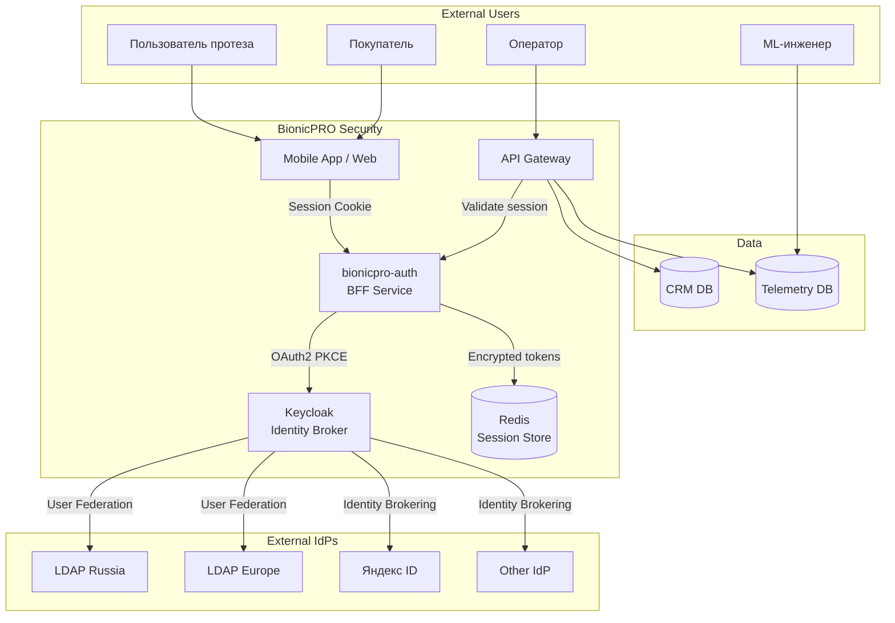
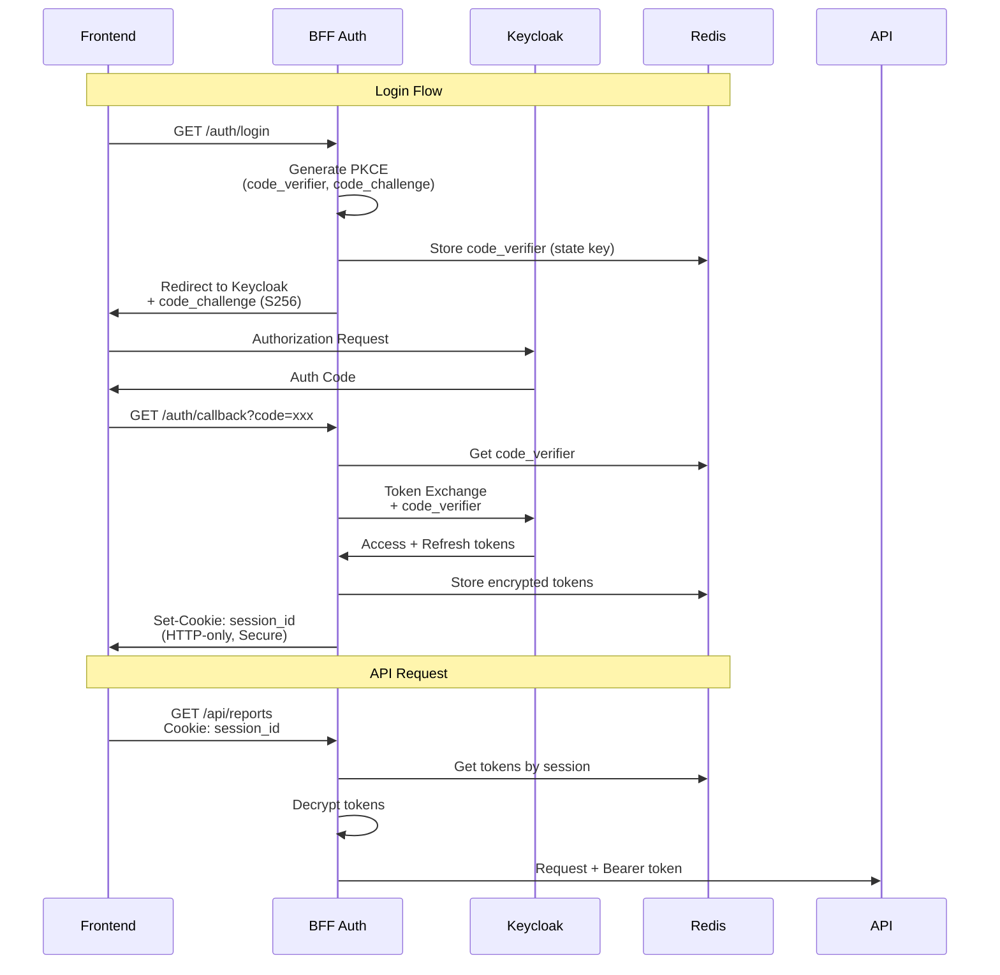

# Security Architecture (Task 1)

## Обзор

Задание 1 реализует усиленную архитектуру безопасности с единым управлением доступом и паттерном BFF (Backend-for-Frontend).

## Реализованные возможности

| Компонент | Описание |
|-----------|----------|
| **LDAP User Federation** | Централизованное управление пользователями через OpenLDAP |
| **BFF Pattern** | Серверное хранение токенов, HTTP-only session cookies |
| **OAuth2 PKCE** | Безопасный authorization code flow с S256 challenge |
| **Identity Brokering** | Поддержка внешних IdP (Яндекс ID, Google, Apple) |
| **MFA/TOTP** | Обязательная двухфакторная аутентификация |

## Архитектурная диаграмма



## BFF Pattern (Backend-for-Frontend)

### Принцип работы



### Преимущества BFF

| Аспект | Описание |
|--------|----------|
| **Безопасность токенов** | Access/Refresh токены никогда не попадают на клиент |
| **Автоматическое обновление** | BFF автоматически обновляет access_token по refresh_token |
| **Session Fixation Protection** | Ротация session ID после аутентификации |
| **XSS Protection** | HTTP-only cookies недоступны из JavaScript |
| **CSRF Protection** | SameSite cookie attribute |

### Конфигурация BFF

```python
# bionicpro-auth/app.py
SECURE_COOKIES = os.getenv("SECURE_COOKIES", "true").lower() == "true"
SESSION_COOKIE_HTTPONLY = True
SESSION_COOKIE_SECURE = SECURE_COOKIES
SESSION_COOKIE_SAMESITE = "Lax"
```

## Keycloak Configuration

### User Federation (LDAP)

Keycloak синхронизирует пользователей с LDAP серверами представительств:

```yaml
# Конфигурация в realm-export.json
userFederation:
  - name: ldap-russia
    providerId: ldap
    config:
      connectionUrl: ldap://ldap:389
      usersDn: ou=People,dc=bionicpro,dc=com
      bindDn: cn=admin,dc=bionicpro,dc=com
      userObjectClasses: inetOrgPerson
      usernameAttribute: uid
      syncRegistrations: true
```

### Identity Brokering (Яндекс ID)

```yaml
# Конфигурация внешнего IdP
identityProviders:
  - alias: yandex
    providerId: oidc
    config:
      authorizationUrl: https://oauth.yandex.ru/authorize
      tokenUrl: https://oauth.yandex.ru/token
      userInfoUrl: https://login.yandex.ru/info
      clientId: ${YANDEX_CLIENT_ID}
      clientSecret: ${YANDEX_CLIENT_SECRET}
```

### MFA/TOTP Configuration

```yaml
# Обязательная двухфакторная аутентификация
requiredActions:
  - CONFIGURE_TOTP

authenticationFlows:
  - alias: browser-with-otp
    authenticationExecutions:
      - authenticator: auth-username-password-form
        requirement: REQUIRED
      - authenticator: auth-otp-form
        requirement: REQUIRED
```

## LDAP Structure

```
dc=bionicpro,dc=com
├── ou=People
│   ├── uid=ivan.petrov
│   │   ├── cn: Ivan Petrov
│   │   ├── mail: ivan.petrov@bionicpro.com
│   │   └── employeeType: prothetic_user
│   ├── uid=maria.sidorova
│   ├── uid=alexey.kozlov
│   ├── uid=john.mueller
│   └── uid=anna.schmidt
├── ou=Groups
│   ├── cn=prothetic_users
│   ├── cn=users
│   └── cn=administrators
└── ou=Roles
    ├── cn=prothetic_user
    ├── cn=user
    └── cn=administrator
```

## Тестовые пользователи

| Username | Password | Роль | Регион |
|----------|----------|------|--------|
| ivan.petrov | password123 | prothetic_user | Россия |
| maria.sidorova | password123 | user | Россия |
| alexey.kozlov | password123 | administrator | Россия |
| john.mueller | password123 | prothetic_user | Европа |
| anna.schmidt | password123 | user | Европа |

## OAuth2 PKCE Flow

### Генерация PKCE

```python
import secrets
import hashlib
import base64

def generate_pkce():
    # code_verifier: 43-128 символов
    code_verifier = secrets.token_urlsafe(32)

    # code_challenge: SHA256(code_verifier), base64url encoded
    digest = hashlib.sha256(code_verifier.encode()).digest()
    code_challenge = base64.urlsafe_b64encode(digest).rstrip(b'=').decode()

    return code_verifier, code_challenge
```

### Authorization Request

```http
GET /realms/reports-realm/protocol/openid-connect/auth
    ?client_id=bionicpro-auth
    &response_type=code
    &scope=openid profile email
    &redirect_uri=http://localhost:8000/auth/callback
    &state=abc123
    &code_challenge=E9Melhoa2OwvFrEMTJguCHaoeK1t8URWbuGJSstw-cM
    &code_challenge_method=S256
```

### Token Exchange

```http
POST /realms/reports-realm/protocol/openid-connect/token
Content-Type: application/x-www-form-urlencoded

grant_type=authorization_code
&code=xxx
&redirect_uri=http://localhost:8000/auth/callback
&client_id=bionicpro-auth
&code_verifier=dBjftJeZ4CVP-mB92K27uhbUJU1p1r_wW1gFWFOEjXk
```

## Session Management

### Redis Storage Structure

```
session:{session_id}:
  access_token: <encrypted>
  refresh_token: <encrypted>
  user_info: {
    sub: "user-uuid",
    preferred_username: "ivan.petrov",
    email: "ivan.petrov@bionicpro.com",
    roles: ["prothetic_user"]
  }
  created_at: 1704067200
  expires_at: 1704070800
```

### Token Encryption

```python
from cryptography.fernet import Fernet

# ENCRYPTION_KEY из .env
fernet = Fernet(os.getenv("ENCRYPTION_KEY"))

def encrypt_token(token: str) -> str:
    return fernet.encrypt(token.encode()).decode()

def decrypt_token(encrypted: str) -> str:
    return fernet.decrypt(encrypted.encode()).decode()
```

## Security Headers

```python
# Response headers
@app.after_request
def security_headers(response):
    response.headers['X-Content-Type-Options'] = 'nosniff'
    response.headers['X-Frame-Options'] = 'DENY'
    response.headers['X-XSS-Protection'] = '1; mode=block'
    response.headers['Strict-Transport-Security'] = 'max-age=31536000'
    return response
```

## Endpoints

| Method | Endpoint | Описание |
|--------|----------|----------|
| GET | `/auth/login` | Инициация OAuth2 PKCE flow |
| GET | `/auth/callback` | OAuth2 callback, обмен кода на токены |
| POST | `/auth/logout` | Завершение сессии |
| GET | `/auth/me` | Информация о текущем пользователе |
| GET | `/health` | Health check |

## Конфигурация (Yandex ID)

Для настройки входа через Яндекс ID:

1. Зарегистрируйте приложение на https://oauth.yandex.ru/
2. Установите Callback URL: `http://localhost:8080/realms/reports-realm/broker/yandex/endpoint`
3. Добавьте в `.env`:

```bash
YANDEX_CLIENT_ID=your-client-id
YANDEX_CLIENT_SECRET=your-client-secret
```

## Troubleshooting

### Invalid token error

```bash
# Проверьте Keycloak
curl -s http://localhost:8080/health/ready

# Очистите Redis кэш
docker-compose exec redis redis-cli FLUSHALL
```

### LDAP connection failed

```bash
# Проверьте LDAP
ldapsearch -x -H ldap://localhost:389 \
  -D "cn=admin,dc=bionicpro,dc=com" \
  -w admin \
  -b "ou=People,dc=bionicpro,dc=com"
```

## См. также

- [Architecture Overview](overview.md)
- [Deployment Guide](../deployment/quickstart.md)
- [Auth API Reference](../api/auth.md)
