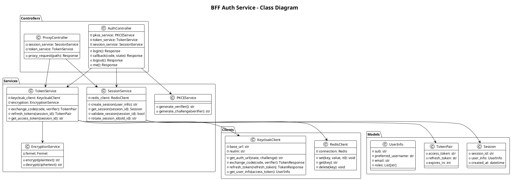
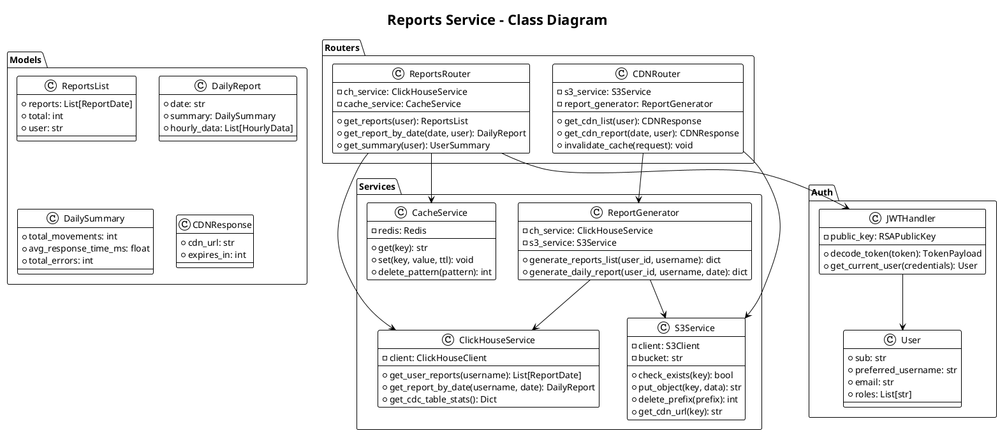
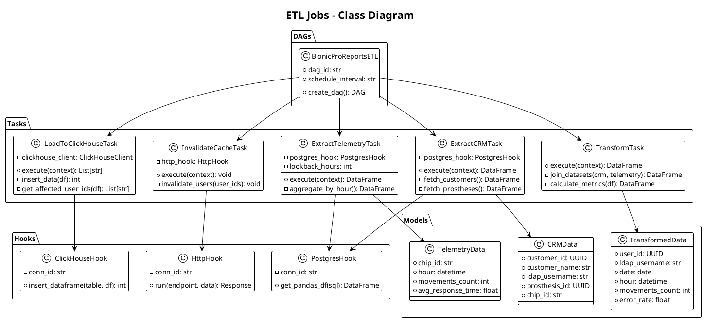
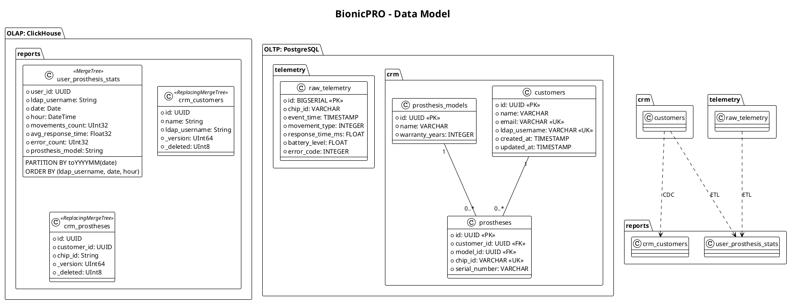

# C4 Level 4: Code (Class Diagrams)

## Описание

Class Diagrams показывают структуру кода ключевых сервисов системы BionicPRO.

## BFF Auth Service Classes

---

## Reports Service Classes

---

## ETL Jobs Classes

---

## Data Model

## Исходные файлы

- [c4-level4-bff-classes.puml](c4-level4-bff-classes.puml)
- [c4-level4-reports-classes.puml](c4-level4-reports-classes.puml)
- [c4-level4-etl-classes.puml](c4-level4-etl-classes.puml)
- [c4-level4-data-model.puml](c4-level4-data-model.puml)
