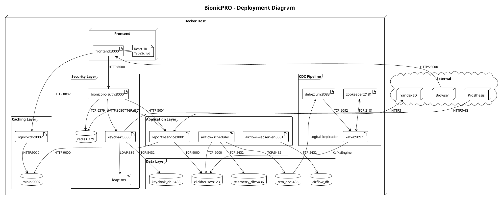

# Deployment Diagram

## Описание

Deployment Diagram показывает физическое размещение компонентов системы BionicPRO в Docker контейнерах.

## Диаграмма развёртывания



## Сервисы и порты

### Внешние порты

| Сервис | Порт | Протокол | Описание |
|--------|------|----------|----------|
| Frontend | 3000 | HTTP | React SPA |
| BFF Auth | 8000 | HTTP | Authentication API |
| Reports Service | 8001 | HTTP | Reports REST API |
| Nginx CDN | 8002 | HTTP | CDN Proxy |
| Keycloak | 8080 | HTTP | Identity Provider |
| Airflow | 8081 | HTTP | ETL Web UI |
| Debezium | 8083 | HTTP | CDC REST API |
| Kafka UI | 8084 | HTTP | Kafka Monitoring |
| ClickHouse HTTP | 8123 | HTTP | OLAP HTTP API |
| MinIO Console | 9001 | HTTP | S3 Web UI |
| MinIO S3 API | 9002 | HTTP | S3 API |
| Kafka | 9092 | TCP | Message Broker |

### Внутренние порты (Docker network)

| Сервис | Порт | Протокол |
|--------|------|----------|
| Redis | 6379 | TCP |
| LDAP | 389 | LDAP |
| ClickHouse Native | 9000 | TCP |
| Zookeeper | 2181 | TCP |
| PostgreSQL (all) | 5432 | TCP |

## Docker Compose Services

```yaml
services:
  # Frontend
  frontend:              # :3000

  # Security Layer
  keycloak:              # :8080
  keycloak_db:           # :5433
  ldap:                  # :389
  bionicpro-auth:        # :8000
  redis:                 # :6379

  # Application Layer
  reports-service:       # :8001
  airflow-webserver:     # :8081
  airflow-scheduler:     # internal

  # Data Layer
  crm_db:                # :5435
  telemetry_db:          # :5436
  clickhouse:            # :8123, :9000

  # CDC Pipeline
  kafka:                 # :9092
  zookeeper:             # :2181
  debezium:              # :8083

  # Caching Layer
  minio:                 # :9001, :9002
  nginx-cdn:             # :8002
```

## Volumes (Persistent Data)

| Volume | Контейнер | Описание |
|--------|-----------|----------|
| postgres-keycloak-data | keycloak_db | Keycloak database |
| postgres-bionicpro-data | bionicpro_db | User profiles |
| postgres-crm-data | crm_db | CRM data |
| postgres-telemetry-data | telemetry_db | Telemetry data |
| postgres-airflow-data | airflow_db | Airflow metadata |
| clickhouse-data | clickhouse | OLAP data |
| minio-data | minio | S3 objects |
| redis-data | redis | Sessions |
| ldap-data | ldap | LDAP data |
| kafka-data | kafka | Kafka logs |

## Resource Requirements

### Minimum

| Resource | Value |
|----------|-------|
| CPU | 4 cores |
| RAM | 8 GB |
| Disk | 20 GB |

### Recommended

| Resource | Value |
|----------|-------|
| CPU | 8 cores |
| RAM | 16 GB |
| Disk | 50 GB |

### Per-Service Memory Allocation

| Service | Memory |
|---------|--------|
| Keycloak | 512MB - 1GB |
| ClickHouse | 1GB - 4GB |
| Kafka + Zookeeper | 1GB |
| Airflow (total) | 1GB - 2GB |
| PostgreSQL (each) | 256MB - 512MB |
| Other services | 128MB - 256MB |

## Network Topology

```
┌─────────────────────────────────────────────────────────────┐
│                     Docker Network (bridge)                  │
│                                                              │
│  ┌──────────┐   ┌──────────┐   ┌──────────┐                │
│  │ frontend │   │   bff    │   │ reports  │                │
│  │  :3000   │──▶│  :8000   │──▶│  :8001   │                │
│  └──────────┘   └────┬─────┘   └────┬─────┘                │
│                      │              │                       │
│                      ▼              ▼                       │
│               ┌──────────┐   ┌──────────┐                  │
│               │ keycloak │   │clickhouse│                  │
│               │  :8080   │   │:8123/9000│                  │
│               └────┬─────┘   └────┬─────┘                  │
│                    │              │                        │
│                    ▼              ▼                        │
│  ┌──────────┐ ┌──────────┐ ┌──────────┐ ┌──────────┐     │
│  │   ldap   │ │  redis   │ │  kafka   │ │  minio   │     │
│  │   :389   │ │  :6379   │ │  :9092   │ │  :9002   │     │
│  └──────────┘ └──────────┘ └──────────┘ └──────────┘     │
└─────────────────────────────────────────────────────────────┘
```

## Исходный файл

[deployment-diagram.puml](deployment-diagram.puml)
