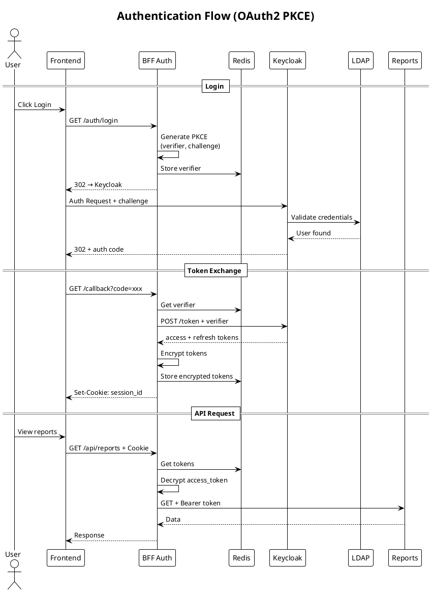
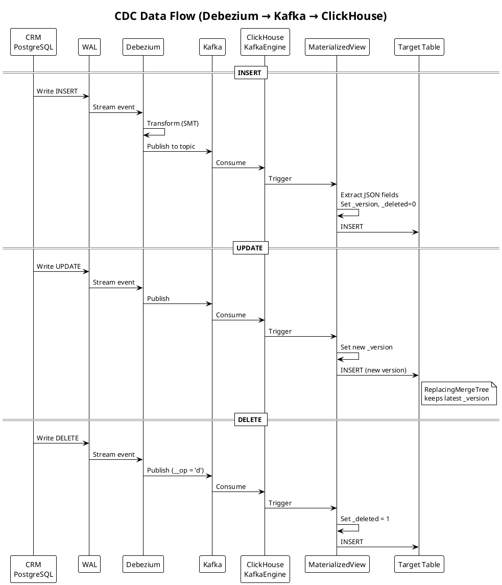
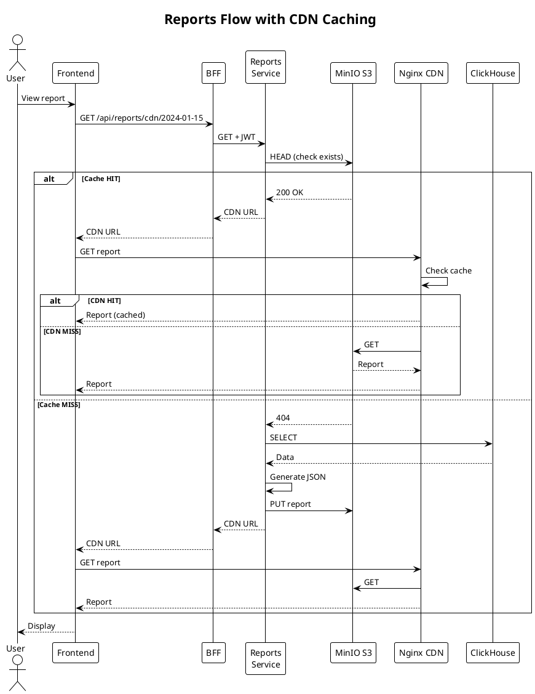

# Sequence Diagrams

## Описание

Диаграммы последовательности показывают взаимодействие компонентов системы во времени для ключевых бизнес-процессов.

## Authentication Flow (OAuth2 PKCE)

Процесс аутентификации пользователя с использованием OAuth2 PKCE flow.



---

## CDC Data Flow

Процесс репликации данных из CRM в ClickHouse через CDC pipeline.



---

## Reports Flow with CDN Caching

Процесс получения отчётов с использованием CDN кэширования.



---

## ETL Pipeline Flow

Процесс выполнения ETL pipeline в Apache Airflow.

```plantuml
@startuml ETL_Flow
!theme plain
title ETL Pipeline Flow

participant "Scheduler" as Sched
participant "Executor" as Exec
participant "CRM DB" as CRM
participant "Telemetry DB" as TEL
participant "ClickHouse" as CH
participant "Reports\nService" as RS

Sched -> Exec: Trigger DAG\n(*/15 * * * *)

== Parallel Extract ==
par
    Exec -> CRM: SELECT customers,\nprostheses, models
    CRM --> Exec: CRM DataFrame
and
    Exec -> TEL: SELECT aggregated\ntelemetry
    TEL --> Exec: Telemetry DataFrame
end

== Transform ==
Exec -> Exec: JOIN on chip_id
Exec -> Exec: Calculate metrics:\nerror_rate, etc.

== Load ==
Exec -> CH: INSERT INTO\nuser_prosthesis_stats
CH --> Exec: OK

Exec -> Exec: Get affected user_ids

== Invalidate Cache ==
loop for each user_id
    Exec -> RS: POST /invalidate
    RS --> Exec: OK
end

Exec -> Sched: DAG completed

@enduml
```

## Исходные файлы

- [sequence-auth-flow.puml](sequence-auth-flow.puml)
- [sequence-cdc-flow.puml](sequence-cdc-flow.puml)
- [sequence-reports-flow.puml](sequence-reports-flow.puml)
- [sequence-etl-flow.puml](sequence-etl-flow.puml)
